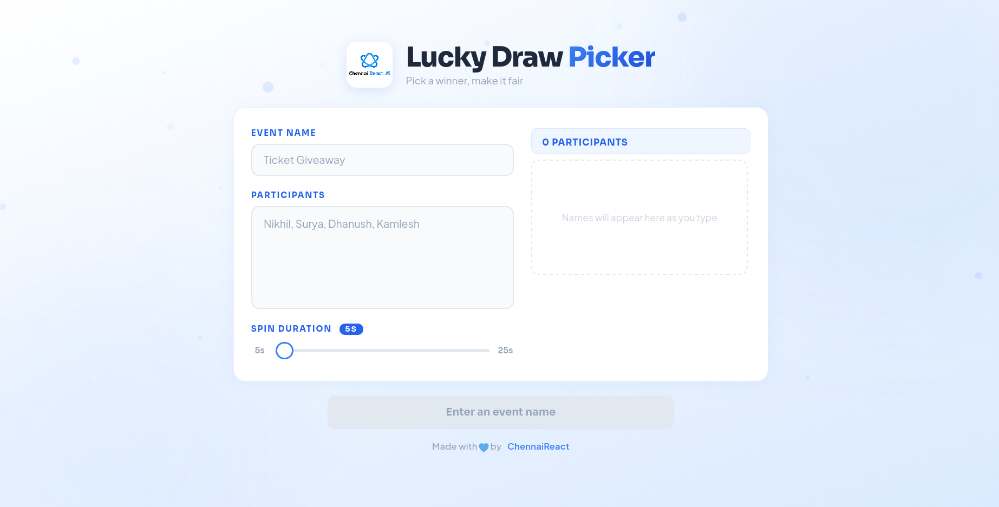

# Lucky Draw Picker

A clean, presentation-ready lucky draw wheel built with React, Vite, and Framer Motion. Designed for conferences, meetups, and events — with big-screen visibility, smooth animations, and an image-downloadable winner card.



## Features

- **Spin wheel** with easeOutQuart deceleration and tick sound effects
- **Dynamic font sizing** — winner name auto-scales for long names
- **Colorful confetti** with timed bursts for celebration
- **Downloadable winner card** as a clean PNG image
- **Spin duration slider** — 5s to 25s configurable per draw
- **Two-column input** — form on the left, live participant list on the right
- **Presentation mode** — scales up for large screens (1400px+ and 1800px+)
- **Audio feedback** — tick sounds while spinning, chord on winner reveal
- **Clean corporate aesthetic** — no emoji clutter, minimal winner card for exports

## Tech Stack

- [React](https://react.dev) + [Vite](https://vite.dev)
- [Framer Motion](https://motion.dev) — animations
- [canvas-confetti](https://github.com/catdad/canvas-confetti) — confetti effects
- [html2canvas](https://html2canvas.hertzen.com) — winner card image export

## Getting Started

```bash
# Install dependencies
npm install

# Start dev server
npm run dev

# Build for production
npm run build

# Preview production build
npm run preview
```

## Usage

1. Enter an **event name** (e.g. "Ticket Giveaway")
2. Type **participant names** separated by commas
3. Set the **spin duration** using the slider (5–25 seconds)
4. Click **Continue** → **Pick a Winner**
5. Celebrate 🎉 — confetti bursts every 5 seconds
6. **Save Image** to download a clean winner card PNG
7. **Draw Again** or start with a **New List**

## Scripts

| Command                 | Description                    |
| ----------------------- | ------------------------------ |
| `npm run dev`           | Start development server       |
| `npm run build`         | Build for production           |
| `npm run preview`       | Preview production build       |
| `npm run lint`          | Run ESLint on all files        |
| `npm run format`        | Format all files with Prettier |
| `npm run test`          | Run tests in watch mode        |
| `npm run test:run`      | Run tests once                 |
| `npm run test:coverage` | Run tests with coverage report |

## Project Structure

```
luckydraw-picker/
├── public/
│   └── screenshots/        # App screenshots
├── src/
│   ├── test/
│   │   ├── setup.js         # Test environment setup (canvas/audio mocks)
│   │   ├── logic.test.js    # Pure logic unit tests
│   │   └── App.test.jsx     # React component integration tests
│   ├── App.css              # All styles
│   ├── App.jsx              # Main app + all components
│   ├── index.css            # Global/reset styles
│   └── main.jsx             # Entry point
├── .husky/
│   ├── pre-commit           # lint-staged (ESLint + Prettier)
│   └── pre-push             # lint + test:run
├── vitest.config.js         # Vitest configuration
├── eslint.config.js         # ESLint flat config
└── package.json
```

## Testing

The project uses [Vitest](https://vitest.dev) with [Testing Library](https://testing-library.com) for a fast, reliable test suite.

```bash
# Run all tests
npm run test:run

# Run tests in watch mode (during development)
npm run test

# Run with coverage
npm run test:coverage
```

### Test Categories

- **Logic tests** (`src/test/logic.test.js`) — Pure function tests for name parsing, winner selection algorithm, reel building, easeOutQuart easing, visibleItems computation, dynamic font sizing, validation, and range calculations.
- **Component tests** (`src/test/App.test.jsx`) — React component integration tests for input rendering, participant counting, button states, step navigation, and UI behavior.

## Git Hooks

[Husky](https://github.com/typicode/husky) enforces code quality automatically:

- **pre-commit** — Runs [lint-staged](https://github.com/lint-staged/lint-staged) which:
  - Lints and fixes JS/JSX files with ESLint
  - Formats JS/JSX, JSON, CSS, and MD files with Prettier
- **pre-push** — Runs `npm run lint` and `npm run test:run` to block pushing if anything fails

## License

This project is licensed under the [MIT License](LICENSE) — © ChennaiReact Team

---

Made with 💙 by [ChennaiReact](https://chennaireact.in)
